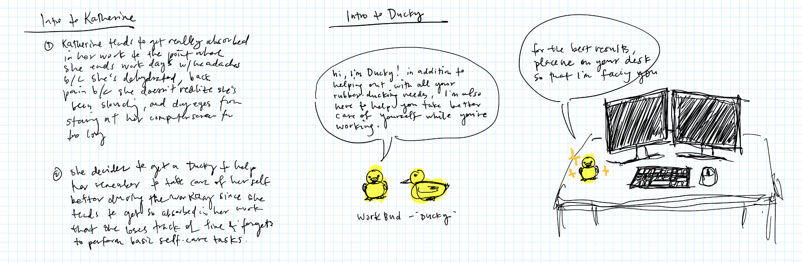
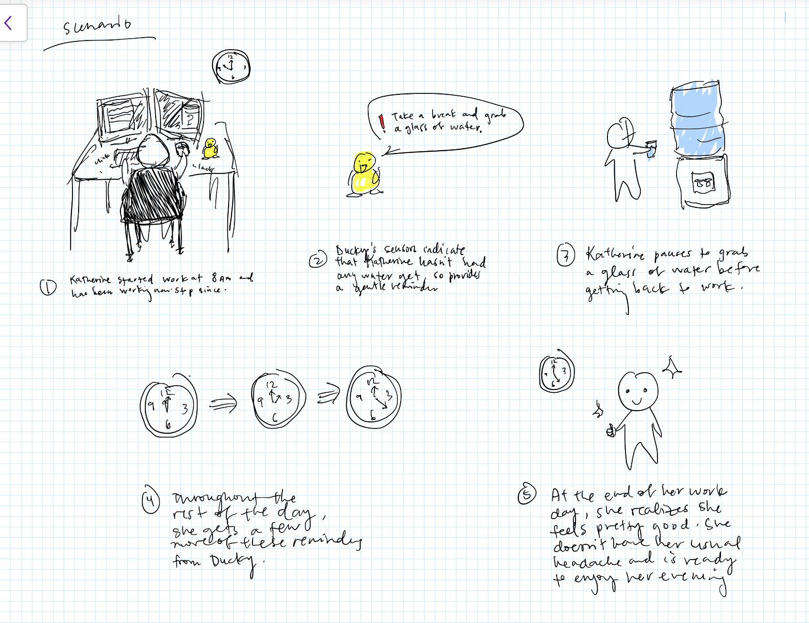
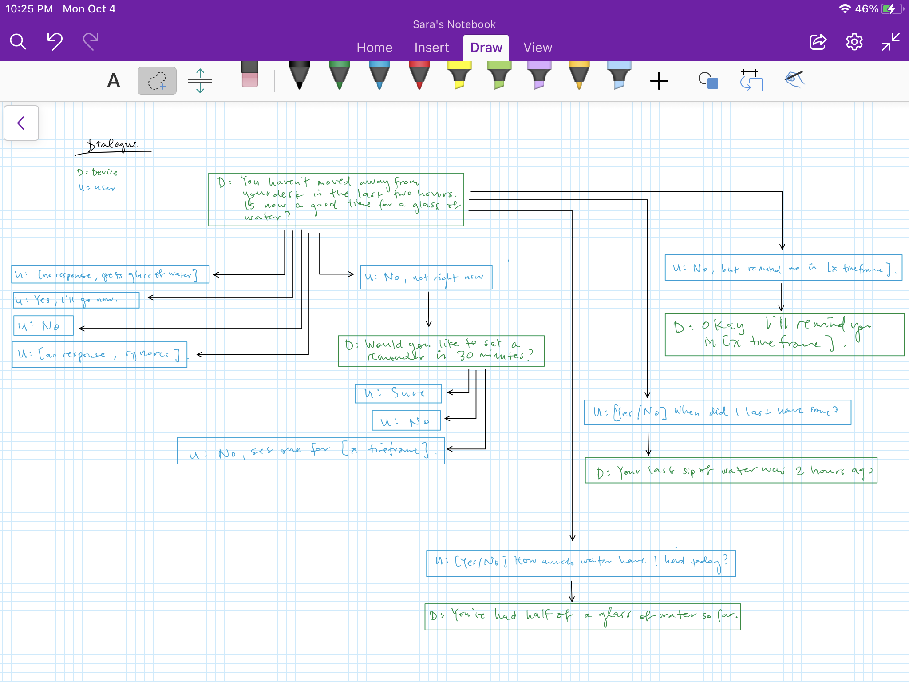
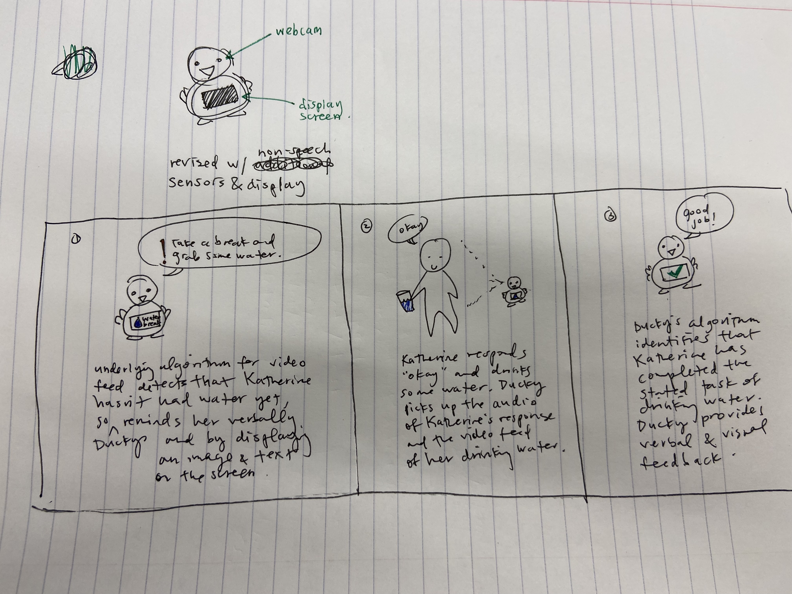
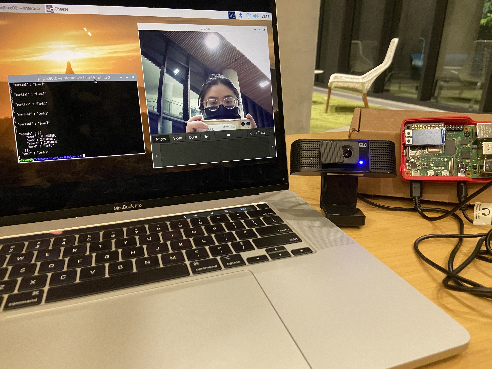

# Chatterboxes
[](https://www.youtube.com/embed/Q8FWzLMobx0?start=19)

In this lab, we want you to design interaction with a speech-enabled device--something that listens and talks to you. This device can do anything *but* control lights (since we already did that in Lab 1).  First, we want you first to storyboard what you imagine the conversational interaction to be like. Then, you will use wizarding techniques to elicit examples of what people might say, ask, or respond.  We then want you to use the examples collected from at least two other people to inform the redesign of the device.

We will focus on **audio** as the main modality for interaction to start; these general techniques can be extended to **video**, **haptics** or other interactive mechanisms in the second part of the Lab.

## Prep for Part 1: Get the Latest Content and Pick up Additional Parts 

### Pick up Additional Parts

As mentioned during the class, we ordered additional mini microphone for Lab 3. Also, a new part that has finally arrived is encoder! Please remember to pick them up from the TA.

### Get the Latest Content

As always, pull updates from the class Interactive-Lab-Hub to both your Pi and your own GitHub repo. As we discussed in the class, there are 2 ways you can do so:

**\[recommended\]**Option 1: On the Pi, `cd` to your `Interactive-Lab-Hub`, pull the updates from upstream (class lab-hub) and push the updates back to your own GitHub repo. You will need the *personal access token* for this.

```
pi@ixe00:~$ cd Interactive-Lab-Hub
pi@ixe00:~/Interactive-Lab-Hub $ git pull upstream Fall2021
pi@ixe00:~/Interactive-Lab-Hub $ git add .
pi@ixe00:~/Interactive-Lab-Hub $ git commit -m "get lab3 updates"
pi@ixe00:~/Interactive-Lab-Hub $ git push
```

Option 2: On your your own GitHub repo, [create pull request](https://github.com/FAR-Lab/Developing-and-Designing-Interactive-Devices/blob/2021Fall/readings/Submitting%20Labs.md) to get updates from the class Interactive-Lab-Hub. After you have latest updates online, go on your Pi, `cd` to your `Interactive-Lab-Hub` and use `git pull` to get updates from your own GitHub repo.

## Part 1.
### Text to Speech 

In this part of lab, we are going to start peeking into the world of audio on your Pi! 

We will be using a USB microphone, and the speaker on your webcamera. (Originally we intended to use the microphone on the web camera, but it does not seem to work on Linux.) In the home directory of your Pi, there is a folder called `text2speech` containing several shell scripts. `cd` to the folder and list out all the files by `ls`:

```
pi@ixe00:~/text2speech $ ls
Download        festival_demo.sh  GoogleTTS_demo.sh  pico2text_demo.sh
espeak_demo.sh  flite_demo.sh     lookdave.wav
```

You can run these shell files by typing `./filename`, for example, typing `./espeak_demo.sh` and see what happens. Take some time to look at each script and see how it works. You can see a script by typing `cat filename`. For instance:

```
pi@ixe00:~/text2speech $ cat festival_demo.sh 
#from: https://elinux.org/RPi_Text_to_Speech_(Speech_Synthesis)#Festival_Text_to_Speech

echo "Just what do you think you're doing, Dave?" | festival --tts
```

Now, you might wonder what exactly is a `.sh` file? Typically, a `.sh` file is a shell script which you can execute in a terminal. The example files we offer here are for you to figure out the ways to play with audio on your Pi!

You can also play audio files directly with `aplay filename`. Try typing `aplay lookdave.wav`.

\*\***Write your own shell file to use your favorite of these TTS engines to have your Pi greet you by name.**\*\*
See my_shell_GoogleTTS.sh in this repo.

Bonus: If this topic is very exciting to you, you can try out this new TTS system we recently learned about: https://github.com/rhasspy/larynx

### Speech to Text

Now examine the `speech2text` folder. We are using a speech recognition engine, [Vosk](https://alphacephei.com/vosk/), which is made by researchers at Carnegie Mellon University. Vosk is amazing because it is an offline speech recognition engine; that is, all the processing for the speech recognition is happening onboard the Raspberry Pi. 

In particular, look at `test_words.py` and make sure you understand how the vocab is defined. Then try `./vosk_demo_mic.sh`

One thing you might need to pay attention to is the audio input setting of Pi. Since you are plugging the USB cable of your webcam to your Pi at the same time to act as speaker, the default input might be set to the webcam microphone, which will not be working for recording.

\*\***Write your own shell file that verbally asks for a numerical based input (such as a phone number, zipcode, number of pets, etc) and records the answer the respondent provides.**\*\*

My shell file is my_speech_to_text.sh and uses my_vosk_engine.py.

Bonus Activity:

If you are really excited about Speech to Text, you can try out [Mozilla DeepSpeech](https://github.com/mozilla/DeepSpeech) and [voice2json](http://voice2json.org/install.html)
There is an included [dspeech](./dspeech) demo  on the Pi. If you're interested in trying it out, we suggest you create a seperarate virutal environment for it . Create a new Python virtual environment by typing the following commands.

```
pi@ixe00:~ $ virtualenv dspeechexercise
pi@ixe00:~ $ source dspeechexercise/bin/activate
(dspeechexercise) pi@ixe00:~ $ 
```

### Serving Pages

In Lab 1, we served a webpage with flask. In this lab, you may find it useful to serve a webpage for the controller on a remote device. Here is a simple example of a webserver.

```
pi@ixe00:~/Interactive-Lab-Hub/Lab 3 $ python server.py
 * Serving Flask app "server" (lazy loading)
 * Environment: production
   WARNING: This is a development server. Do not use it in a production deployment.
   Use a production WSGI server instead.
 * Debug mode: on
 * Running on http://0.0.0.0:5000/ (Press CTRL+C to quit)
 * Restarting with stat
 * Debugger is active!
 * Debugger PIN: 162-573-883
```
From a remote browser on the same network, check to make sure your webserver is working by going to `http://<YourPiIPAddress>:5000`. You should be able to see "Hello World" on the webpage.

### Storyboard

Storyboard and/or use a Verplank diagram to design a speech-enabled device. (Stuck? Make a device that talks for dogs. If that is too stupid, find an application that is better than that.) 

\*\***Post your storyboard and diagram here.**\*\*

My device is an assistant that helps the user take better care of themselves when they're working at their desk. The assistant monitors the user, tracking when they step away from their desk, their posture, water intake, etc. It then provides reminders to drink water, take breaks, sit up straight, etc. My work for the first part of this lab will focus on water intake.

Introducing the user persona and device:


Storyboard:


Write out what you imagine the dialogue to be. Use cards, post-its, or whatever method helps you develop alternatives or group responses. 

\*\***Please describe and document your process.**\*\*

To map out the dialogue, I used OneNote with my tablet. This gave me the flexibility to list out possible responses, move the chunks of dialogue around, group them, and add directional arrows to show the flow of the dialogue.



### Acting out the dialogue

A recording of the acted-out dialogue is [here](https://drive.google.com/file/d/15vdRknuGdh9ebwcPG_VIaepM7xr7gnif/view?usp=sharing).

\*\***Describe if the dialogue seemed different than what you imagined when it was acted out, and how.**\*\*

Overall the dialogue was what I expected. However, as I was acting as the device, I felt the need to provide feedback when my actor completed the task I wanted. I had not originally planned for any feedback after the user responded affirmatively and drank some water, but wound up throwing in a "Good job!" to make the overall interaction feel more natural and personable.

### Wizarding with the Pi (optional)
In the [demo directory](./demo), you will find an example Wizard of Oz project. In that project, you can see how audio and sensor data is streamed from the Pi to a wizard controller that runs in the browser.  You may use this demo code as a template. By running the `app.py` script, you can see how audio and sensor data (Adafruit MPU-6050 6-DoF Accel and Gyro Sensor) is streamed from the Pi to a wizard controller that runs in the browser `http://<YouPiIPAddress>:5000`. You can control what the system says from the controller as well!

\*\***Describe if the dialogue seemed different than what you imagined, or when acted out, when it was wizarded, and how.**\*\*

# Lab 3 Part 2

For Part 2, you will redesign the interaction with the speech-enabled device using the data collected, as well as feedback from part 1.

## Prep for Part 2

1. What are concrete things that could use improvement in the design of your device? For example: wording, timing, anticipation of misunderstandings...

Concrete areas for improvement are improving the conversation flow by providing feedback when the user responds to something. Additionally, a user may not always naturally respond with verbal feedback and will instead nod/shake their head or otherwise user body language. Being able to react to body language would also improve the design.

2. What are other modes of interaction _beyond speech_ that you might also use to clarify how to interact?

Leveraging visual interactions could clarify how to interact. This could include using a display to output an image or text regarding a task to provide a visual mode of communication. This could also include using video input to evaluate the user's body language, gestures, and movements. Other possible interactions could include having the user use buttons to respond to the device's queries.

3. Make a new storyboard, diagram and/or script based on these reflections.

My new storyboard incorporates visual sensing via the webcam video feed as well as a visual display. Since my main dialogue change was adding basic feedback of "okay" or "good job" to user responses, I did not re-draw the diagram. I also added dialogue to ask for a repeat if input was not understood.



## Prototype your system

The system should:
* use the Raspberry Pi 
* use one or more sensors
* require participants to speak to it. 

The system uses the webcam's video to collect visual input and the USB microphone to take in audio speech input from the user. The audio input is processed using the VOSK Kaldi recognizer with a pre-defined dictionary. Video input is interpreted by the controller. The device must be placed in front of and facing the user to effectively take in the video input.

The control setup includes a terminal window and a video display input. The terminal window is used to execute Python scripts. The Python scripts execute shell scripts containing the TTS and STT functionality. Some scripts are also accompanied by code to display images to reinforce what is being verbally communicated by the device.

The scripts created are:
- [water_prompt.py](./water_prompt.py): this displays an image of a water droplet and asks the user if now is a good time to drink some water
- [reminder_prompt.py](./reminder_prompt.py): this asks the user if they want to be reminded in 30 min to drink some water
- [reminder_set.py](./reminder_set.py): this tells the user that a reminder has been set
- [good_job.py](./good_job.py): this says "good job" to the user to provide feedback to the user
- [okay.py](./okay.py): this says "okay" to the user to provide feedback to the user
- [unknown_response.py](./unknown_response.py): this tells the user that the input was not understood and asks the user to repeat the input

The image below shows the controller setup on the left and the system setup on the right.


The below videos show how the controller manages the system and the system's responses.
- Water prompt: https://drive.google.com/file/d/1W4AlvwWzt3QYKa8ICSCYCsDFDrqvv1sb/view?usp=sharing
- Other scripts: https://drive.google.com/file/d/1_Px2otTIR5jB_2jkGfWU8rNIsTl8YM79/view?usp=sharing

## Test the system
Try to get at least two people to interact with your system. (Ideally, you would inform them that there is a wizard _after_ the interaction, but we recognize that can be hard.)

Videos of my user interactions are below:
- User 1: https://drive.google.com/file/d/1OP3bbHhlPZApddZCMfv_pMgYHki8fGRT/view?usp=sharing
- User 2: https://drive.google.com/file/d/101JSn_SqasMflfk0vpjEc2RhMHTEmbqU/view?usp=sharing

Answer the following:

### What worked well about the system and what didn't?

The visual display was clear and timely. The TTS system used was also relatively clear to understand. From a visual perspective, the system does not require the user to make any specific/unnatural movements. On the audio end, the time length of the recording when the system was waiting for input was much longer in some cases than the response users provided. Users weren't sure why there were long periods of silence and weren't sure how to engage with the system in this instances. The interaction could thus feel unnatural due to the stilted back-and-forth. The physical device (including webcam, pi, and usb microphone) were awkward to place to get good positioning such that the webcam was facing the user, the display on the pi was visible to the user, and the user could easily access the mic (to have it pick up sound).

### What worked well about the controller and what didn't?

Using the webcam's video functionality worked well for controlling the system since the input was reliable and could be easily interpreted by a human. It also felt like executing the scripts took more time than I wanted since I needed to type the command to execute the script. The hardcoded duration for recording audio input also felt uncomfortably long given the shorter responses that my participants provided. The audio processing also frequently did not interpret the speech correctly and I relied more heavily on visual signals from the video feed. Finally, executing pre-determined scripts did not provide flexibility for adjusting speech on the fly.

### What lessons can you take away from the WoZ interactions for designing a more autonomous version of the system?

Hardcoding the interactions limits the ways that the system can interact with and respond to the user. It's also critical to come up with ways to make the interaction more seamless and real time -- even mere seconds can be too long and cause the interaction to feel unnatural. Being able to store user audio input and automatically decide how the system should respond (i.e. through NLP, ML prediction, etc) would allow for more autonomy with the system. Similarly, training and leveraging models to interpret visual input from video would allow for a more autonomous version of the system.

### How could you use your system to create a dataset of interaction? What other sensing modalities would make sense to capture?

The system could be used to create a dataset of interaction by recording and saving the audio inputs in the context of what prompts the audio was in response to. Video data could similarly be recorded and saved. Other sensing modalities that could be useful could include providing button/toggle input for users and sensing to track volume of water consumed over time. Future work to expand the system to other self-care tasks like improving posture or taking breaks could incorporate accelerometer and proximity sensors or even eye-tracking data.

