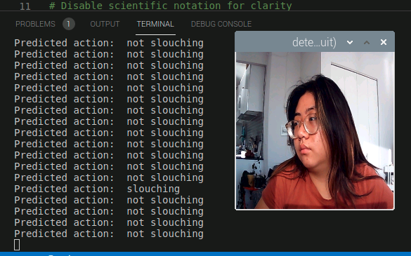
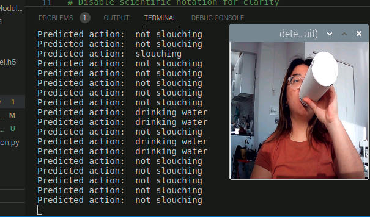
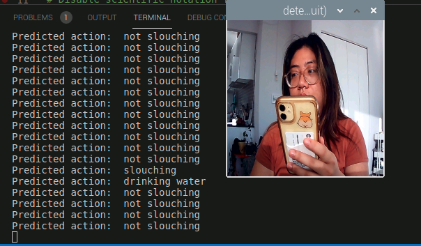

# Observant Systems


For lab this week, we focus on creating interactive systems that can detect and respond to events or stimuli in the environment of the Pi, like the Boat Detector we mentioned in lecture. 
Your **observant device** could, for example, count items, find objects, recognize an event or continuously monitor a room.

This lab will help you think through the design of observant systems, particularly corner cases that the algorithms needs to be aware of.

## Prep

1.  Pull the new Github Repo.
2.  Install VNC on your laptop if you have not yet done so. This lab will actually require you to run script on your Pi through VNC so that you can see the video stream. Please refer to the [prep for Lab 2](https://github.com/FAR-Lab/Interactive-Lab-Hub/blob/Fall2021/Lab%202/prep.md), we offered the instruction at the bottom.
3.  Read about [OpenCV](https://opencv.org/about/), [MediaPipe](https://mediapipe.dev/), and [TeachableMachines](https://teachablemachine.withgoogle.com/).
4.  Read Belloti, et al.'s [Making Sense of Sensing Systems: Five Questions for Designers and Researchers](https://www.cc.gatech.edu/~keith/pubs/chi2002-sensing.pdf).

### For the lab, you will need:

1. Raspberry Pi
1. Webcam 
1. Microphone (if you want to have speech or sound input for your design)

### Deliverables for this lab are:
1. Show pictures, videos of the "sense-making" algorithms you tried.
1. Show a video of how you embed one of these algorithms into your observant system.
1. Test, characterize your interactive device. Show faults in the detection and how the system handled it.

## Overview
Building upon the paper-airplane metaphor (we're understanding the material of machine learning for design), here are the four sections of the lab activity:

A) [Play](#part-a)

B) [Fold](#part-b)

C) [Flight test](#part-c)

D) [Reflect](#part-d)

---

### Part A
### Play with different sense-making algorithms.

#### OpenCV
A more traditional method to extract information out of images is provided with OpenCV. The RPI image provided to you comes with an optimized installation that can be accessed through python. We included 4 standard OpenCV examples: contour(blob) detection, face detection with the ``Haarcascade``, flow detection (a type of keypoint tracking), and standard object detection with the [Yolo](https://pjreddie.com/darknet/yolo/) darknet.

Most examples can be run with a screen (e.g. VNC or ssh -X or with an HDMI monitor), or with just the terminal. The examples are separated out into different folders. Each folder contains a ```HowToUse.md``` file, which explains how to run the python example. 

Following is a nicer way you can run and see the flow of the `openCV-examples` we have included in your Pi. Instead of `ls`, the command we will be using here is `tree`. [Tree](http://mama.indstate.edu/users/ice/tree/) is a recursive directory colored listing command that produces a depth indented listing of files. Install `tree` first and `cd` to the `openCV-examples` folder and run the command:

```shell
pi@ixe00:~ $ sudo apt install tree
...
pi@ixe00:~ $ cd openCV-examples
pi@ixe00:~/openCV-examples $ tree -l
.
├── contours-detection
│   ├── contours.py
│   └── HowToUse.md
├── data
│   ├── slow_traffic_small.mp4
│   └── test.jpg
├── face-detection
│   ├── face-detection.py
│   ├── faces_detected.jpg
│   ├── haarcascade_eye_tree_eyeglasses.xml
│   ├── haarcascade_eye.xml
│   ├── haarcascade_frontalface_alt.xml
│   ├── haarcascade_frontalface_default.xml
│   └── HowToUse.md
├── flow-detection
│   ├── flow.png
│   ├── HowToUse.md
│   └── optical_flow.py
└── object-detection
    ├── detected_out.jpg
    ├── detect.py
    ├── frozen_inference_graph.pb
    ├── HowToUse.md
    └── ssd_mobilenet_v2_coco_2018_03_29.pbtxt
```

The flow detection might seem random, but consider [this recent research](https://cseweb.ucsd.edu/~lriek/papers/taylor-icra-2021.pdf) that uses optical flow to determine busy-ness in hospital settings to facilitate robot navigation. Note the velocity parameter on page 3 and the mentions of optical flow.

Now, connect your webcam to your Pi and use **VNC to access to your Pi** and open the terminal. Use the following command lines to try each of the examples we provided:
(***it will not work if you use ssh from your laptop***)

```
pi@ixe00:~$ cd ~/openCV-examples/contours-detection
pi@ixe00:~/openCV-examples/contours-detection $ python contours.py
...
pi@ixe00:~$ cd ~/openCV-examples/face-detection
pi@ixe00:~/openCV-examples/face-detection $ python face-detection.py
...
pi@ixe00:~$ cd ~/openCV-examples/flow-detection
pi@ixe00:~/openCV-examples/flow-detection $ python optical_flow.py 0 window
...
pi@ixe00:~$ cd ~/openCV-examples/object-detection
pi@ixe00:~/openCV-examples/object-detection $ python detect.py
```

**\*\*\*Try each of the following four examples in the `openCV-examples`, include screenshots of your use and write about one design for each example that might work based on the individual benefits to each algorithm.\*\*\***

Contour Detection
<p align="center"> </p>
Possible applications include image segmentation and detecting the presence of a user/entity.


Face Detection
<p align="center"> </p>
Possible applications include face authentication, taking photos/portraits, detecting the presence of a user, identifying people from images.


Optical Flow
<p align="center"> </p>
Possible applications include movement detection (e.g. for automatic lights) and robot navigation.


Object Detection
<p align="center"> </p>
A possible application could be for autonomous vehicles.


#### MediaPipe

A more recent open source and efficient method of extracting information from video streams comes out of Google's [MediaPipe](https://mediapipe.dev/), which offers state of the art face, face mesh, hand pose, and body pose detection.


To get started, create a new virtual environment with special indication this time:

```
pi@ixe00:~ $ virtualenv mpipe --system-site-packages
pi@ixe00:~ $ source mpipe/bin/activate
(mpipe) pi@ixe00:~ $ 
```

and install the following.

```
...
(mpipe) pi@ixe00:~ $ sudo apt install ffmpeg python3-opencv
(mpipe) pi@ixe00:~ $ sudo apt install libxcb-shm0 libcdio-paranoia-dev libsdl2-2.0-0 libxv1  libtheora0 libva-drm2 libva-x11-2 libvdpau1 libharfbuzz0b libbluray2 libatlas-base-dev libhdf5-103 libgtk-3-0 libdc1394-22 libopenexr23
(mpipe) pi@ixe00:~ $ pip3 install mediapipe-rpi4 pyalsaaudio
```

Each of the installs will take a while, please be patient. After successfully installing mediapipe, connect your webcam to your Pi and use **VNC to access to your Pi**, open the terminal, and go to Lab 5 folder and run the hand pose detection script we provide:
(***it will not work if you use ssh from your laptop***)


```
(mpipe) pi@ixe00:~ $ cd Interactive-Lab-Hub/Lab\ 5
(mpipe) pi@ixe00:~ Interactive-Lab-Hub/Lab 5 $ python hand_pose.py
```

Try the two main features of this script: 1) pinching for percentage control, and 2) "[Quiet Coyote](https://www.youtube.com/watch?v=qsKlNVpY7zg)" for instant percentage setting. Notice how this example uses hardcoded positions and relates those positions with a desired set of events, in `hand_pose.py` lines 48-53. 

**\*\*\*Consider how you might use this position based approach to create an interaction, and write how you might use it on either face, hand or body pose tracking.\*\*\***

<p align="center"> </p>
<p align="center"> </p>

Some applications for a position based approach could including teaching/learning ASL, emotion detection, posture detection (i.e. yoga, fitness, dance poses or positions), gestures for device control.

(You might also consider how this notion of percentage control with hand tracking might be used in some of the physical UI you may have experimented with in the last lab, for instance in controlling a servo or rotary encoder.)


#### Teachable Machines
Google's [TeachableMachines](https://teachablemachine.withgoogle.com/train) might look very simple. However, its simplicity is very useful for experimenting with the capabilities of this technology.


To get started, create and activate a new virtual environment for this exercise with special indication:

```
pi@ixe00:~ $ virtualenv tmachine --system-site-packages
pi@ixe00:~ $ source tmachine/bin/activate
(tmachine) pi@ixe00:~ $ 
```

After activating the virtual environment, install the requisite TensorFlow libraries by running the following lines:
```
(tmachine) pi@ixe00:~ $ cd Interactive-Lab-Hub/Lab\ 5
(tmachine) pi@ixe00:~ Interactive-Lab-Hub/Lab 5 $ sudo chmod +x ./teachable_machines.sh
(tmachine) pi@ixe00:~ Interactive-Lab-Hub/Lab 5 $ ./teachable_machines.sh
``` 

This might take a while to get fully installed. After installation, connect your webcam to your Pi and use **VNC to access to your Pi**, open the terminal, and go to Lab 5 folder and run the example script:
(***it will not work if you use ssh from your laptop***)

```
(tmachine) pi@ixe00:~ Interactive-Lab-Hub/Lab 5 $ python tm_ppe_detection.py
```


(**Optionally**: You can train your own model, too. First, visit [TeachableMachines](https://teachablemachine.withgoogle.com/train), select Image Project and Standard model. Second, use the webcam on your computer to train a model. For each class try to have over 50 samples, and consider adding a background class where you have nothing in view so the model is trained to know that this is the background. Then create classes based on what you want the model to classify. Lastly, preview and iterate, or export your model as a 'Tensorflow' model, and select 'Keras'. You will find an '.h5' file and a 'labels.txt' file. These are included in this labs 'teachable_machines' folder, to make the PPE model you used earlier. You can make your own folder or replace these to make your own classifier.)

**\*\*\*Whether you make your own model or not, include screenshots of your use of Teachable Machines, and write how you might use this to create your own classifier. Include what different affordances this method brings, compared to the OpenCV or MediaPipe options.\*\*\***

PPE Detection model
<p align="center"> </p>

My own model -- slouching vs not slouching
<p align="center"> </p>
<p align="center"> </p>

Teachables Machines allows the user to not have to define or know the explicit features that might be needed to classify the image into one category or another. This allows greater flexibility for what we can train Teachable Machines to classify compared to the other approaches (since those are limited by human knowledge/expertise), but requires greater care in thinking about and experimenting with the training data. You could use this to create your own classifier by scraping images from the web or otherwise collecting a variety of images to train different classification tasks.

*Don't forget to run ```deactivate``` to end the Teachable Machines demo, and to reactivate with ```source tmachine/bin/activate``` when you want to use it again.*


#### Filtering, FFTs, and Time Series data. (optional)
Additional filtering and analysis can be done on the sensors that were provided in the kit. For example, running a Fast Fourier Transform over the IMU data stream could create a simple activity classifier between walking, running, and standing.

Using the accelerometer, try the following:

**1. Set up threshold detection** Can you identify when a signal goes above certain fixed values?

**2. Set up averaging** Can you average your signal in N-sample blocks? N-sample running average?

**3. Set up peak detection** Can you identify when your signal reaches a peak and then goes down?

**\*\*\*Include links to your code here, and put the code for these in your repo--they will come in handy later.\*\*\***


### Part B
### Construct a simple interaction.

Pick one of the models you have tried, pick a class of objects, and experiment with prototyping an interaction.
This can be as simple as the boat detector earlier.
Try out different interaction outputs and inputs.

**\*\*\*Describe and detail the interaction, as well as your experimentation here.\*\*\***

I wanted to try extending my Lab 3. This was a desktop assistant that helped the user take better care of themselves when working at their desk. The overall idea is that the assistant monitored the user, tracking when they stepped away from their desk, their posture, water intake, etc. It then provided reminders to drink water, take breaks, sit up straight, etc.

For this part of the lab, I use Teachable Machines to classify when the user is attentive and not slouching, slouching, drinking water, and looking at their phone.

Overall:
- All training images were taken in the same time period with similar lighting, the same person, and overall the same clothing and background
- I experimented with having my hair down and up
- I experimented with wearing a t-shirt, a vest over my t-shirt and different colored shirt
- I experimented with daytime vs nighttime lighting


Slouching vs not slouching:
- The key behavior I wanted to capture was slouching
- After my initial tests failed, I realized that "Not slouching" encompasses more than just sitting up straight. it also could encompass a wide range of other positions/postures. E.g. leaning back, moving around/in different positions
- I found that angle seemed to matter based on how I had trained my model

<p align="center"> 
    
    
    
    
</p>

Drinking water:
- I primarily used a water bottle in the training images, and later also trained with a glass mug
- System tended to classify me as drinking water when my arm was up, even if I wasn't holding a glass or bottle
- System seemed to be overfitting based on arm/hand presence

<p align="center"> 
    
    
    
    
    
</p>

Looking at phone:
- This one was hard for the system to classify -- it mixed this up with slouching and drinking water and rarely classified me as looking at my phone
- My training images didn't take into account looking down at desk for other reason (e.g. writing on pen and paper, taking notes on ipad, etc)

<p align="center"> 
    
    
    
</p>

### Part C
### Test the interaction prototype

Now flight test your interactive prototype and **note down your observations**:
For example:
1. When does it what it is supposed to do?
1. When does it fail?
1. When it fails, why does it fail?
1. Based on the behavior you have seen, what other scenarios could cause problems?

When I actually implemented my model, I found that it only really outputted classifications as slouching, not slouching, and drinking water despite the training input of looking at my phone. While it outputted both slouching and not slouching, it seemed to misclassify slouching as not slouching more frequently. I saw similar issues of the system identifying a raised arm as drinking water as when I was training the model. 

Slouching
<p align="center"></p>

Not slouching
<p align="center"></p>

Drinking water
<p align="center"></p>

Looking at phone
<p align="center"></p>

**\*\*\*Think about someone using the system. Describe how you think this will work.\*\*\***
1. Are they aware of the uncertainties in the system?
1. How bad would they be impacted by a miss classification?
1. How could change your interactive system to address this?
1. Are there optimizations you can try to do on your sense-making algorithm.

The idea is to nudge the user to sit up straight when slouching -- given that the system appears to be overclassifying most things as slouching, the user would likely receive so many nudges that they would become irritated and stop using the system or learn to ignore the system. A user might find it obvious that the system isn't working as expected -- after all, if they're not slouching and the system is telling them that they're slouching, the user would know that something is wrong. While nothing bad would happen to the user due to a misclassification, this would be irritating and could cause the user to stop using the device. Furthermore, the system fails to provide any meaningful information for the other two classes -- drinking water and looking at phone. Since both of these are incorrectly being classified as slouching, a user won't have their water-drinking tracked and won't be nudged to stop looking at their phone when they're doing so. 

The biggest change to the system would be to improve the training data for the system. Perhaps because the changes are either relatively minute (slouching vs not slouching vs looking at phone) or could result in many varied positions (drinking water), a more diverse and varied dataset is needed to train the model. Alternatively, a change could be to be more prescriptive about the positioning of the webcam or training with more angles. While experimenting, I realized that I had trained the Teachable MAchinese model with my laptop camera (directly in front of me) but my implemented model was using the pi webcam (slightly to my right and above). Another optimization could be to allow the user to provide feedback when something has been misclassified to improve the system.

### Part D
### Characterize your own Observant system

Now that you have experimented with one or more of these sense-making systems **characterize their behavior**.
During the lecture, we mentioned questions to help characterize a material:
* What can you use X for?
* What is a good environment for X?
* What is a bad environment for X?
* When will X break?
* When it breaks how will X break?
* What are other properties/behaviors of X?
* How does X feel?

**\*\*\*Include a short video demonstrating the answers to these questions.\*\*\***

https://drive.google.com/file/d/1TIjG328wqADbgN-jQY88AwECIeiV4FH7/view?usp=sharing

### Part 2.

Following exploration and reflection from Part 1, finish building your interactive system, and demonstrate it in use with a video.

**\*\*\*Include a short video demonstrating the finished result.\*\*\***

For my second pass, I updated my model to exclude the 'looking at phone' class so that I could try to improve the classification of the other three labels. I incorporated more arm motions in not slouching and slouching to try to help the system better distinguish when I was actually drinking water vs just having my arm raised/up for whatever reason. Despite this, as I was working on the code, I found that my model's classification performance seemed to change as time passed. I believe this was due to changes related to image quality such as lighting. The model began only primarily classifying slouching and drinking water. After a few attempts at retraining my model, I changed the model to only classify if I was slouching, and considered everything else to be not slouching.

As for the output, rather than outputting every single classification as I was before, I updated the system to 'interpret' the classifications to something more useful to the user. I had the system only nudge the user to stop slouching if they had been slouching for a set amount of frames to avoid overly frequent notifications. I also tried to account for potential misclassifications within that window by setting the system up such that only 95% of the classifications within the time window had to be 'slouching.' To disable the notification, the user had to be classified as anything other than 'slouching' for at least ten consecutive frames.

For the setup:

When the system was on and sensing, the webcam and button would have lights indicating that they are on. The webcam needs to be placed to replicate the positioning of the camera used to train the model. The button needs to be placed in a visible location.
<p align="center"></p>

When the user has been slouching for the pre-determined amount of time, the button LED light turns on. It turns off when the user is classified as not slouching for a set amount of time.
<p align="center"></p>

Interaction video:

https://drive.google.com/file/d/1hYJI0DL6L-IZKMJCpwsqwlCBdXzjiuOR/view?usp=sharing

Reflections:
- Training the model was much harder than expected, even when only using images of myself in the same location of my apartment as the train and test images. Future work could include training the model more comprehensively to make the model more robust.
- Because of the challenges of training, I wasn't able to have my model classify drinking water and looking at phone. It would be great to include those categories and others in the future.
- It would be interesting to use this model for a longer period of time (e.g. several hours) with a user to better understand how they would interact with the system. In particular, I would want to understand their reactions to the timings of when the LED light is enabled and disabled.